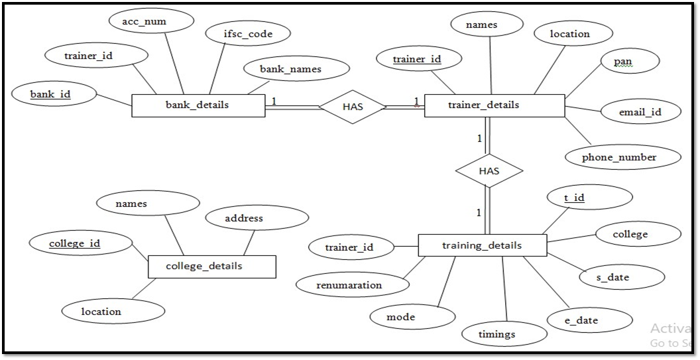

# Invoice-generator
Invoice generation is a web application. The HR of the company uses this application to send the details of the training and invoice to trainers.
HR will select the available trainer according to each training requirement. Once the details are entered by HR in the web application form and submitted, a confirmation mail along with the invoice is sent to the appointed trainer email address.

## Technologies used
* python
* Django
* HTML
* CSS

## System Model
 
 ### System Architecture
 
 
 
 ### E-R Diagram 
 
 
 
## User Interface

 
 
## view of project

### EMAIL Functionality

In this project to send email,I performed few Emails functionality those are as follows:

* Set up SMTP server.
* App specific password generation
* Retrieving trainer’s Email ID from database
* Call the PDF Generator function and attach the PDF to the Confirmation mail.

 
 
### PDF Functionality

* Calling PDF generator function
* FPDF
* Fetching information from database that has to be printed in the PDF.
* The printed information will be stored in “Invoice pdf”.
 
 
  

## CONCLUSION

I have developed this project during my acadamic internship program.
